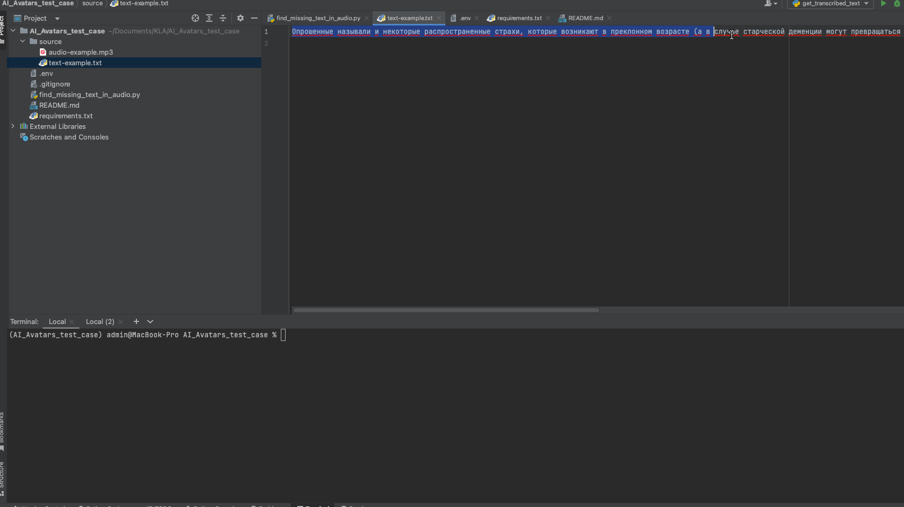

# Бот-викторина.
Данный скрипт позволяет находить в аудировании ошибки типа “потеряшка”. 
- Суть проблемы: часть озвученного текста отсутствует
- Причина проблемы: диктор может пропустить предложение или предложение может быть утеряно при монтаже (в таком случае образуется долгая пауза)
- Пример (в тексте): Опрошенные называли и некоторые распространенные страхи, которые возникают в преклонном возрасте (а в случае старческой деменции могут превращаться в навязчивый бред): это боязнь нищеты, краж, потери памяти и другие тревожные ощущения. А главным проявлением старости почти все назвали потерю независимости — как в физическом, так и в ментальном смысле.
- Пример (в аудио): Опрошенные называли и некоторые распространенные страхи, которые возникают в преклонном возрасте. А главным проявлением старости почти все назвали потерю независимости — как в физическом, так и в ментальном смысле.

Посмотреть демо: 
### Как установить
- [Python3](https://www.python.org/downloads/) должен быть уже установлен. 
- Установить [виртуальное окружение](https://python-scripts.com/virtualenv).

1. Настройки для .
- Создайте аккаунт на [assemblyai](https://www.assemblyai.com/).
- [Скопируйте API key](https://www.assemblyai.com/app/).
- Запишите полученный API key в '.env' как:
```python
AAI_API_KEY='тут ваш API key'
```
  
2. Подготовка файла для обработки.
- Разместите в папке "source" файл с исходным тексто и аудио файл. 


3. Добавить название файлов в '.env' как:
```python
AUDIO='audio-example.mp3'
```

```python
TEXT='text-example.txt'
```

### Как запустить
1. Скачайте код
2. Установите зависимости командой:
```bash
pip install -r requirements.txt
```
3. Запустите скрипт:
```bash
python3 find_missing_text_in_audio.py
```

4. Посмотрите результаты сравнения в файле "comparison_results_for_{audio_filename}.txt"


## Цель проекта

Код написан в рамах тестового задания для AI Avatars
